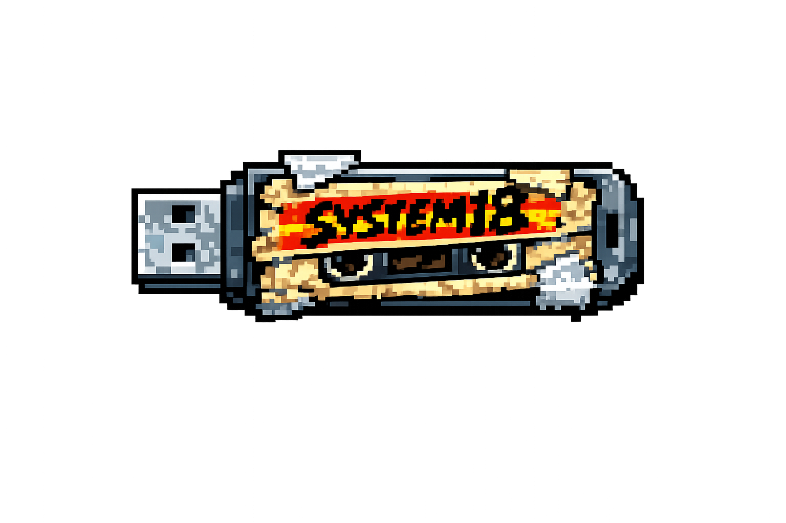

# System18

# System18

A fully automated trading bot platform that backs up decisions with data, adapts strategy to market conditions, manages risk intelligently through a simple AI model, and runs 24/7 on autopilot.

---

## Features

## System18 Strategy Engine

### 1. Momentum

If the price goes up, the bot interprets this as strength and bets that it will continue to rise.  
If the price goes down, the bot avoids entering and does not place a bet.

---

### 2. Mean Reversion

If the price typically trades around 100 and rises to 120, the bot assumes the move may be temporary and bets that the price will return closer to 100.

---

### 3. Volatility-Based Trading

The bot trades based on how much the price moves, not just the direction.

- Large price swings: the bot may trade more actively or take larger positions.  
- Small price swings: the bot may reduce activity or wait for clearer opportunities.

---

## System18 AI-Assisted Signals

### Lightweight Machine Learning Integration (e.g., Linear Regression)

Uses historical price and volume data to predict short-term price trends.

**Example:**  
If a stock has been rising steadily, the bot predicts it may continue upward in the next few minutes and prepares to buy.

---

### Refined Entry and Exit Points

Improves trade timing by using predicted price movements instead of fixed thresholds.

**Example:**  
Instead of buying immediately at $100, the bot predicts $101 as a stronger confirmation level and waits before entering.

---

### Continuous Learning

Tracks the performance of past trades and updates its model to adapt to changing market conditions.

**Example:**  
If a specific price pattern no longer reliably predicts upward movement, the bot adjusts its internal rules to avoid entering trades based on that pattern.

## License

DTFYW

---

**System18** — Trading bot
